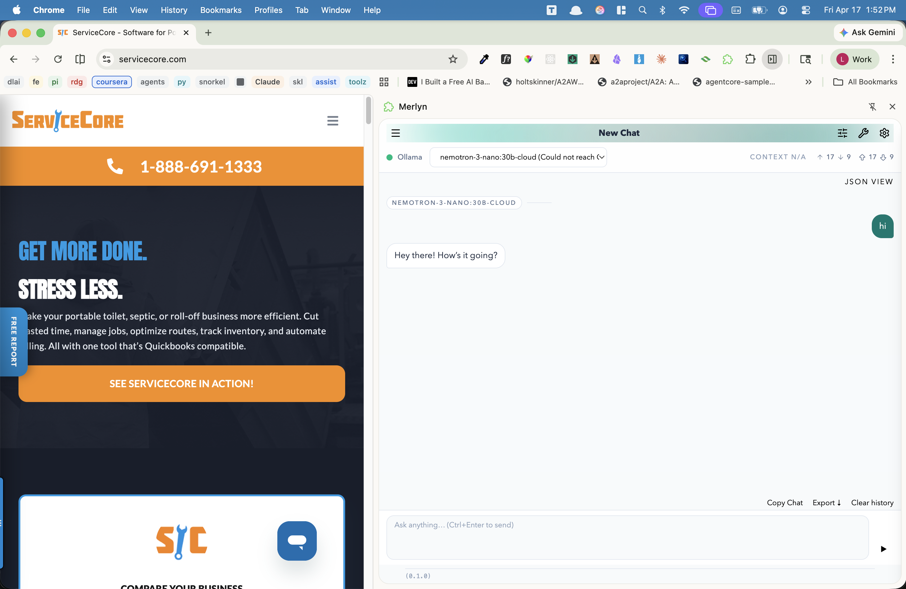
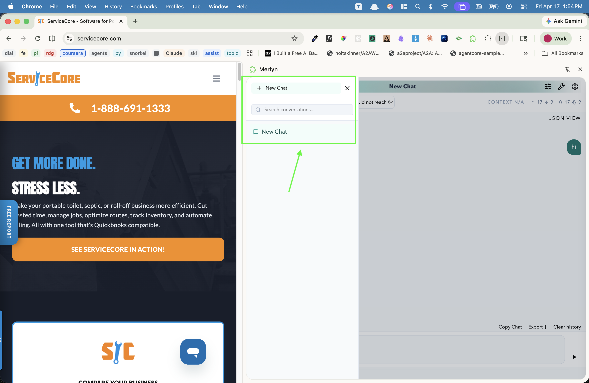

# Merlyn Rename Demo

Hello Everyone! I am excited and jazzed-up for this opportunity to meet with you all and put my best foot forward and my fu on display.

---

## Background

The chosen code sample has been extracted from my chatbot app/Foreman Agent/future coding harness, Merlyn.

Originally spawnned as a CLI app and implemented as lower-level, framework-free project for me head around the ground-level nuts-and-bolts of programmatic LLM interaction, Merlyn has grown to be my coordinator agent in my multi-agent systems, and in this latest incarnation to dress it up with a GUI and elevate it to a packaged productivity app, a browser extension:



Having access to the not only the page context (like Ask Gemini), Merlyn has the tools available to query DevTools panel tabs, leverage CDP, and manipulate various aspect of DOM (_unlike_ Gemini). Or just use it as chatbot to ask something entirely unrelated.

I apologize in advance for the fact UI polish is one of the last endeavors of my workflow after the plumbing is all in place. The design right now, well, still sux.

---

## The Code Sample

The code-in-question for our session is an extraction of the React hook called after the initial user prompt is entered that take the text and send it through a lightweight utility-LLM call to summarize its content to replace the "New Chat" default name created in the ConversationSidebar component with a unique, human-centered tag phrase:



This repository includes a lightweight Vite app server, the ConversationPanel which is the UI target in the isolated system, and a textarea to supply the prompt text that would normally be sent programmatically on the user's first submit. 3 Vitest unit tests have been brought over as well.

The chosen sample is the `useRename()`  React hook below:

```typescript
import { useCallback } from 'react';
import OpenAI from 'openai';
import type { Conversation, DbConversationItem } from '../shared/db';

const OLLAMA_BASE_URL = 'http://adagio.local:11435/v1';
const OLLAMA_MODEL = 'nemotron-3-nano:30b-cloud';

export interface LlmCompletionParams {
  prompt: string;
  instructions?: string;
}

export interface LlmCompletionResult {
  text: string;
  usage?: {
    inputTokens: number;
    outputTokens: number;
    totalTokens: number;
  };
}

export function useRename() {
  const complete = useCallback(async (params: LlmCompletionParams): Promise<LlmCompletionResult | null> => {
    const client = new OpenAI({
      baseURL: OLLAMA_BASE_URL,
      apiKey: 'ollama',
      dangerouslyAllowBrowser: true,
    });

    const messages: Array<{ role: 'system' | 'user'; content: string }> = [];
    if (params.instructions) {
      messages.push({ role: 'system', content: params.instructions });
    }
    messages.push({ role: 'user', content: params.prompt });

    const response = await client.chat.completions.create({
      model: OLLAMA_MODEL,
      messages,
    });

    const text = response.choices[0]?.message?.content?.trim() ?? '';
    return {
      text,
      usage: response.usage
        ? {
            inputTokens: response.usage.prompt_tokens,
            outputTokens: response.usage.completion_tokens,
            totalTokens: response.usage.total_tokens,
          }
        : undefined,
    };
  }, []);

  return { complete } as const;
}

export function buildConversationRenamePrompt(conversation: Conversation, history: DbConversationItem[]): string {
  const transcript = history
    .map((item) => {
      if (item.kind === 'model-info') {
        return `[model] ${item.modelSnapshot.providerName}: ${item.modelSnapshot.displayName}`;
      }
      if (item.kind === 'ooc') {
        return `[system] ${item.content}`;
      }

      return `${item.role}: ${item.content}`;
    })
    .join('\n');

  return [
    `Current title: ${conversation.title}`,
    'Rewrite this chat title as a short, natural, casual summary of what the user is actually talking about.',
    'Write it the way a normal person would describe the topic out loud — plain English, sentence case (only capitalize the first word and proper nouns), regular spaces between words.',
    'Do NOT use CamelCase, PascalCase, snake_case, hyphens, underscores, tags, or programmer-style identifiers.',
    'Do NOT wrap the output in quotes. Do NOT add trailing punctuation. Do NOT prefix with "Title:" or similar.',
    'Return ONLY the new title itself — nothing else.',
    'Keep it short: prefer under 25 characters, max 40 characters.',
    transcript,
  ].join('\n\n');
}

export function sanitizeConversationTitle(raw: string): string {
  const normalized = raw.replace(/[\r\n]+/g, ' ').replace(/\s+/g, ' ').replace(/^["'\s]+|["'\s]+$/g, '').trim();
  if (!normalized) {
    return 'New Chat';
  }

  return normalized.length > 40 ? `${normalized.slice(0, 37).trimEnd()}...` : normalized;
}
```

---

## Beyond the Sample

While the above the is "official" samplke submission, I consider all parts of the repository free game. If there are other areas in the repository you would like to explore, I am good with that.
